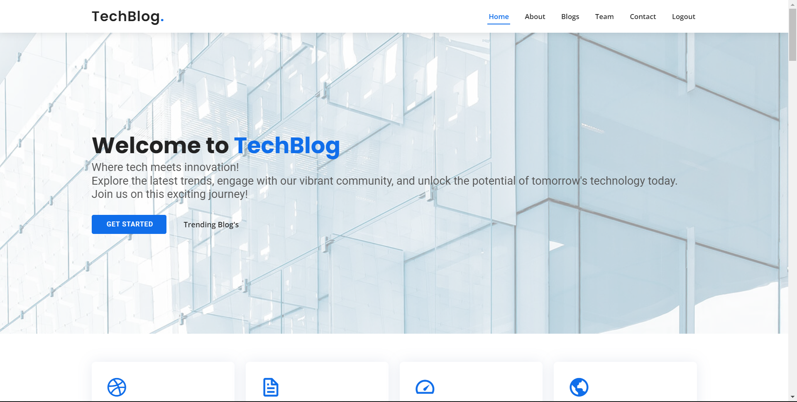
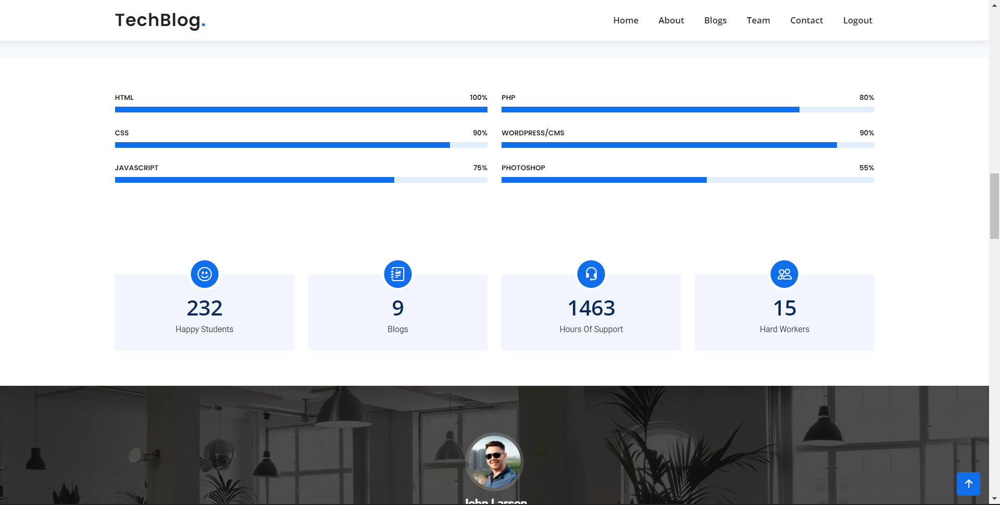
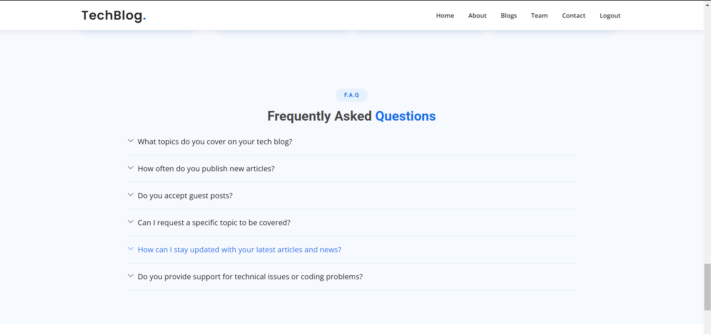
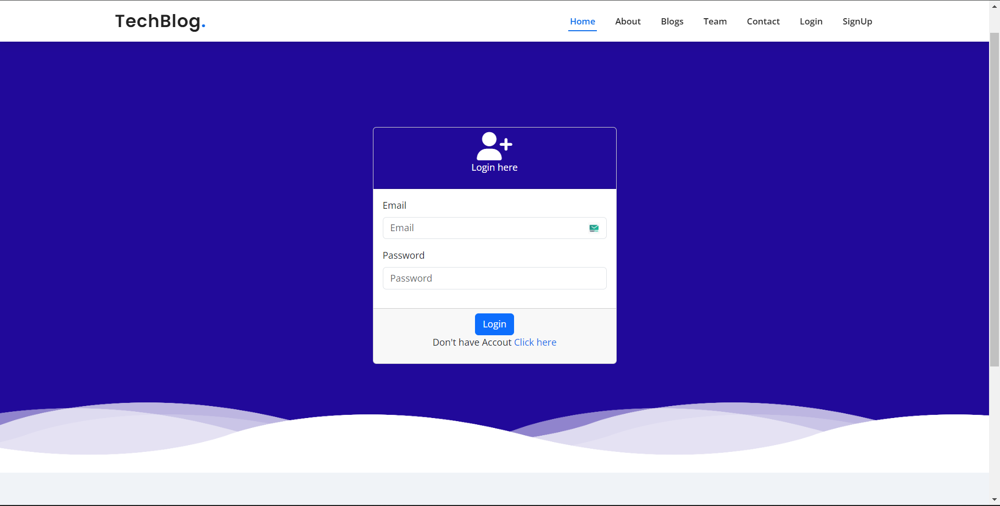
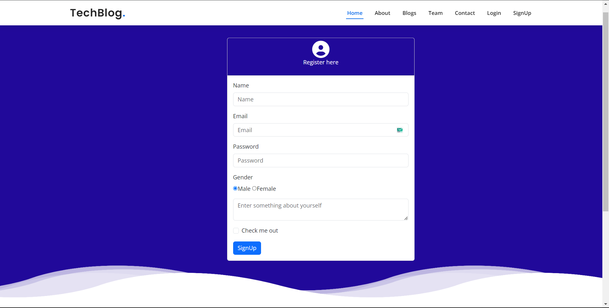
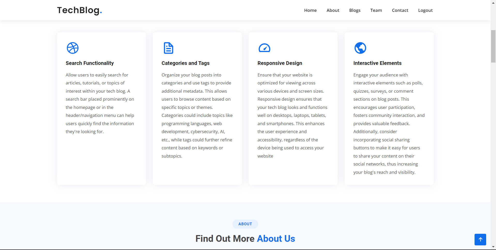
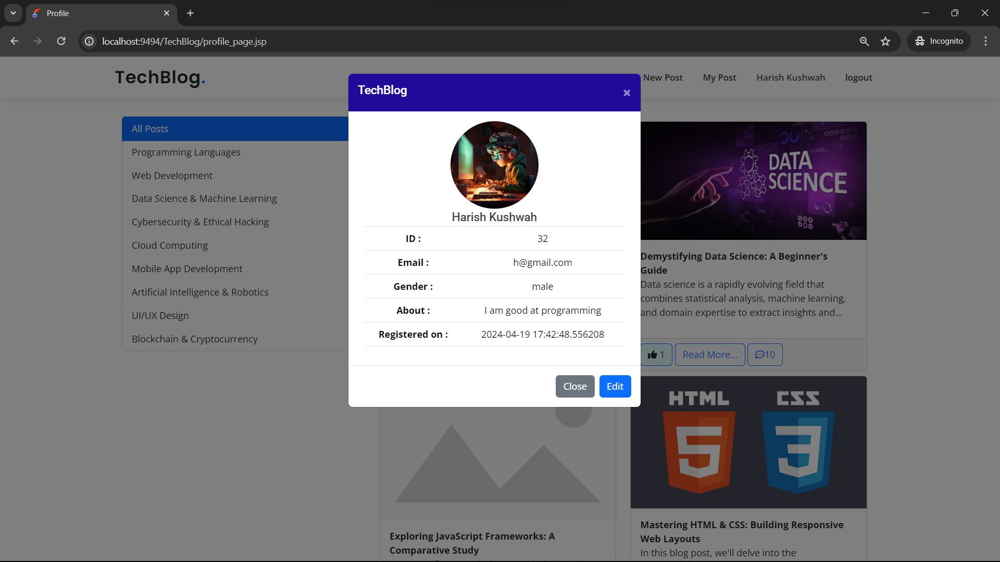
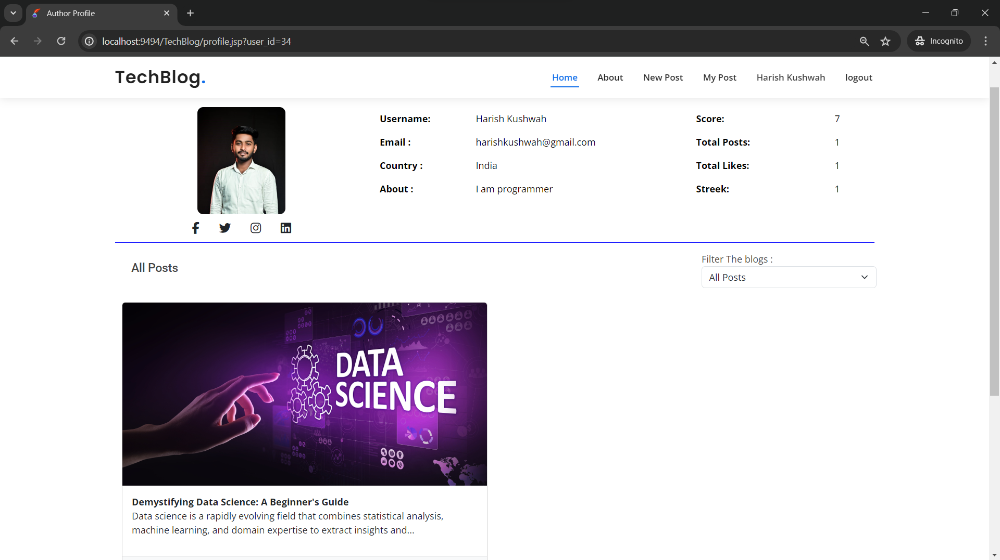
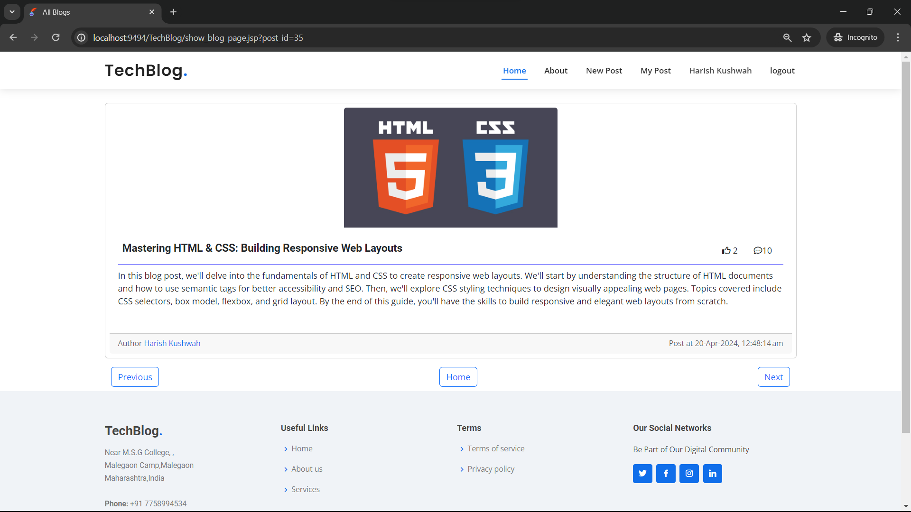

# TechBlog Website

 


## Overview
TechBlog is a dynamic web application built using JSP and Servlet technologies, enabling users to post and view trending tech blogs, manage profiles, and edit content.

## Features
- User registration and login
- Post and view tech blogs
- Manage user profiles
- Edit and delete blog posts
- View trending blogs

## Installation
1. Clone the repository:
    ```bash
    git clone https://github.com/Harish-Kushwah/TechBlog.git
    ```
2. Set up the database:
    - Create a PostgreSQL database named `techblog`.
    - Import the provided `techblog.sql` file to set up the necessary tables.
3. Configure the database connection:
    - Edit the `ConnectionProvider.java` file with your database credentials.

## Usage
1. Deploy the application on a Tomcat server.
2. Access the application in your web browser at `http://localhost:8080/techblog`.

## Screenshots

#### Welcome Page


#### About Us Page


#### Trending Blog


#### Counting


#### FAQ 


#### Home Page


#### Login Page


#### SignUp Page


#### Features Page


#### Blog Post


#### Profile Page


#### User Blogs


#### Complete Blogs


## Contributing
Contributions are welcome! Please fork the repository and submit a pull request for any improvements or bug fixes.

## License
This project is licensed under the MIT License. See the [LICENSE](LICENSE) file for more details.

## Contact
For any questions or feedback, please contact [harishkushwah54321@gmail.com](mailto:harishkushwah54321@gamil.com).
